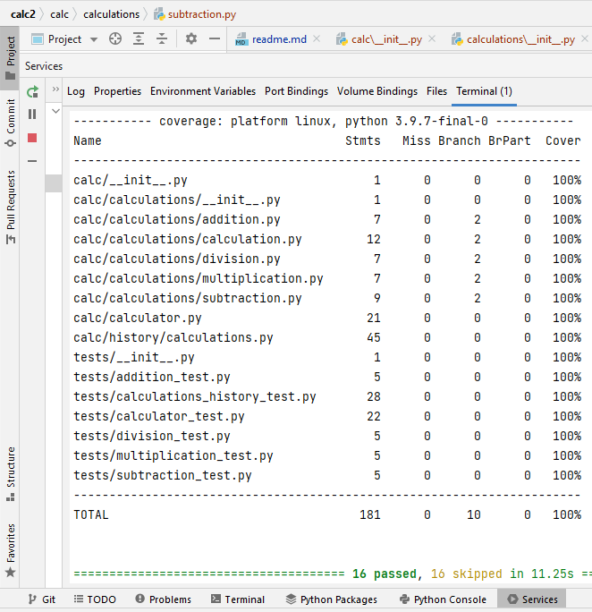

# Project 3

## CSV and File Handling - Design your own code

## Terminal Coverage:
![TerminalCoverage.PNG] (TerminalCoverage.PNG)

## Commit History:
![CommitHistory.PNG] (CommitHistory.PNG)

## Results Log:
![ResultsLog.PNG] (ResultsLog.PNG)

## Configurations & Descriptions of Files Used in the Calculator Part 2 CSV File Handling Project:
### First, run command to install requirements: pip install -r requirements.txt
### In order to run tests, Lint, and Coverage report use the following command:
### pytest --pylint --cov
### .pylintrc is the config for pylint .coveragerc is the config for coverage setup.py is a config file for pytest